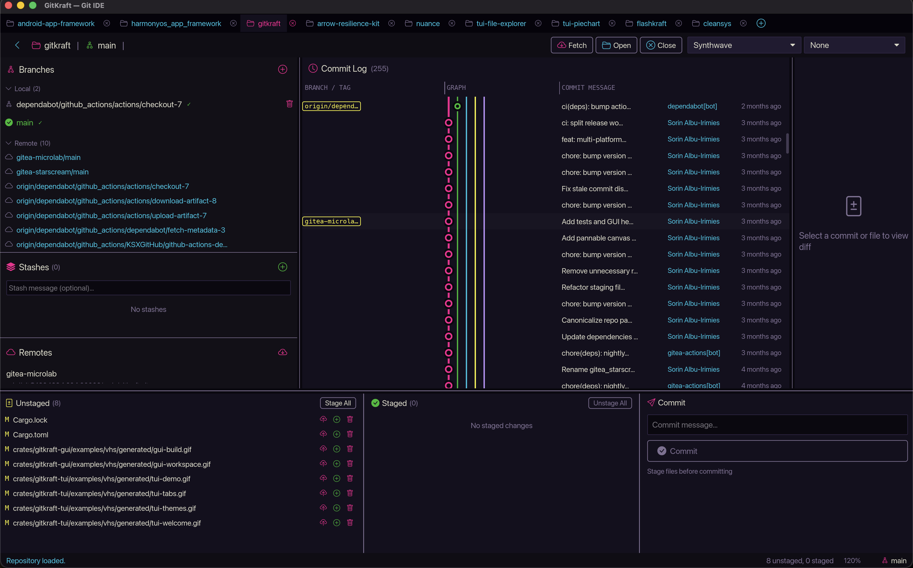
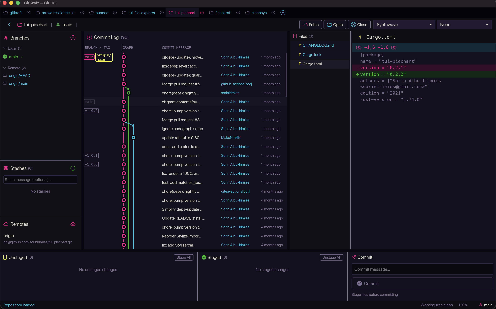
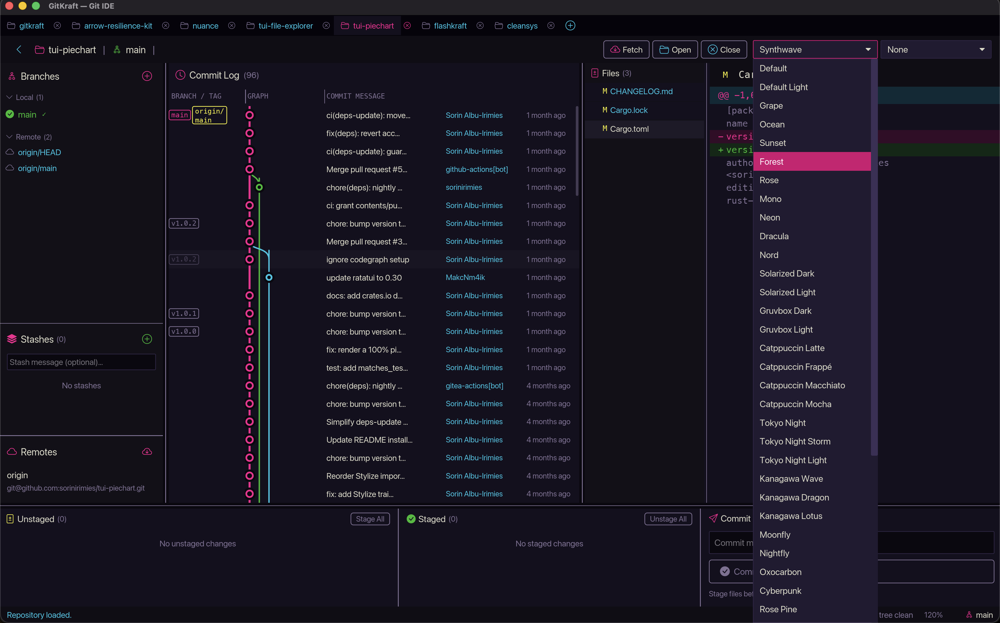

<div align="center">

# ⚡ GitKraft

**A Git IDE written entirely in Rust — desktop GUI & terminal UI**

[](https://crates.io/crates/gitkraft)
[](https://crates.io/crates/gitkraft)
[](https://crates.io/crates/gitkraft-tui)
[](https://docs.rs/gitkraft-core)
[](LICENSE)

</div>

---

GitKraft ships two front-ends from a single Rust workspace:

| Binary | Use case |
|--------|----------|
| `gitkraft` | Desktop GUI — mouse, drag-to-resize panes, commit graph |
| `gitkraft-tui` | Terminal UI — keyboard-driven, great for SSH & headless machines |


## Preview

### Desktop GUI






### Terminal UI


## Features

- **Branch management** — create, checkout, delete, rename, merge, rebase (local & remote)
- **Commit log with graph** — canvas DAG in GUI, box-drawing in TUI
- **Commit actions** — cherry-pick, revert, reset (soft/mixed/hard), create branch/tag at commit, copy SHA
- **Commit search** — incremental search across the commit log
- **Diff viewer** — working-dir, staged, and per-commit diffs with coloured hunks
- **File history & blame** — per-file commit history and line-by-line blame
- **Staging area** — stage/unstage files or all at once, discard or delete files
- **Stash management** — save, apply, pop, drop with optional messages
- **Multi-tab** — open multiple repos in tabs (GUI & TUI), sessions persisted
- **Remote operations** — fetch, push, force-push (`--force-with-lease`), pull (rebase), remote branch checkout/delete
- **Context menus (GUI)** — right-click branches, commits, stashes, and files for the full action set
- **Editor integration** — open files, blame, or `settings.json` in your configured editor
- **UI zoom (GUI)** — Ctrl/Cmd +/− to scale, persisted across launches
- **Directory browser (TUI)** — press `o` to browse and open repos
- **43 colour themes** — Dracula, Nord, Catppuccin, Tokyo Night, Kanagawa, Rose Pine, Cyberpunk, Synthwave, and more
- **Virtual scrolling** — smooth performance with large histories and long diffs
- **Two-phase diff loading** — file list appears instantly, diffs load per-file
- **Draggable pane dividers (GUI)** — layout saved automatically
- **Persisted settings** — theme, layout, recent repos, open tabs (`~/.config/gitkraft` style JSON, no external DB)

## Installation

```sh
# Desktop GUI
cargo install gitkraft

# Terminal UI
cargo install gitkraft-tui
```

Or download pre-built binaries from the [Releases page](https://github.com/sorinirimies/gitkraft/releases).

## Keyboard Shortcuts

### TUI — global (any pane)

| Key | Action |
|-----|--------|
| **←/→** or **Tab / Shift+Tab** | Switch panes |
| **/** | Search commits |
| **,** | Open `settings.json` in editor |
| **o** | Browse & open repo |
| **N / W** | New tab / close tab |
| **] / [** | Next / previous tab |
| **p / P** | Pull (rebase) / push |
| **r / f** | Refresh / fetch |
| **t** | Cycle theme |
| **T / O / E** | Theme panel / options panel / editor panel |
| **q** or **Ctrl+C** | Quit |

### TUI — Branches pane

| Key | Action |
|-----|--------|
| **j/k**, **Enter** | Navigate, checkout selected branch |
| **b** | Create new branch |
| **D** | Delete selected (local) branch |
| **X** | Delete selected remote branch |
| **m** | Merge selected branch into HEAD |
| **R** | Rebase HEAD onto selected branch |
| **e** | Rename selected branch |

### TUI — Commit Log pane

| Key | Action |
|-----|--------|
| **j/k**, **g/G** | Navigate, jump to first/last |
| **J/K**, **Space** | Range-select / toggle multi-select |
| **Enter** | Load diff for selected commit |
| **C** | Cherry-pick commit(s) |
| **e** | Revert commit(s) |
| **n / x / X** | Reset to commit — mixed / soft / hard |
| **F** | Force push (`--force-with-lease`) |
| **y** | Copy commit SHA to clipboard |
| **a** | Open commit action popup (branch/tag here, etc.) |

### TUI — Diff View pane

| Key | Action |
|-----|--------|
| **j/k**, **l/Enter**, **h** | Navigate files, open, back to file list |
| **J/K** | Range-select files |
| **g/G**, **d/u** | Scroll to top/bottom, page down/up (in content) |
| **H** | File history |
| **B** | Blame |
| **e** | Open in editor |
| **o** | Restore file from commit to working directory |

### TUI — Staging pane

| Key | Action |
|-----|--------|
| **j/k**, **Space** | Navigate, toggle selection |
| **Tab** | Switch focus: unstaged ↔ staged |
| **s/u** | Stage / unstage (selected files, or current) |
| **S/U** | Stage / unstage all |
| **d** | Discard changes (press twice to confirm) |
| **D** | Delete file (press twice to confirm) |
| **c** | Commit |
| **z/Z** | Stash save / pop |
| **H/B** | File history / blame |
| **e** | Open in editor |

### TUI — Stash pane

| Key | Action |
|-----|--------|
| **j/k** | Navigate |
| **Enter / p** | Pop selected stash |
| **a** | Apply selected stash (keep in list) |
| **d** | Drop selected stash |

### GUI

| Key | Action |
|-----|--------|
| **Ctrl/Cmd + +/−/0** | Zoom in / out / reset |
| **Ctrl/Cmd + F** | Toggle search |
| **Ctrl/Cmd + T** or **N** | New tab |
| **Ctrl/Cmd + W** | Close current tab |
| **Ctrl/Cmd + R** or **F5** | Refresh |
| **Ctrl/Cmd + ,** | Open `settings.json` in editor |
| **Shift + ↑/↓** | Extend range selection |
| **Esc** | Close overlay / context menu |

Right-click branches, commits, stashes, or files for the full context menu.

## Building from Source

```sh
git clone https://github.com/sorinirimies/gitkraft.git
cd gitkraft
cargo build --release

# Run
cargo run --release -p gitkraft       # GUI
cargo run --release -p gitkraft-tui   # TUI
cargo run --release -p gitkraft-tui -- /path/to/repo
```

**Prerequisites:** a recent stable Rust toolchain (2021 edition).

On Linux, the GUI also needs windowing/graphics dev libraries (X11 + Wayland):

```sh
sudo apt-get install -y pkg-config libxkbcommon-dev libx11-dev libxrandr-dev \
  libxinerama-dev libxcursor-dev libxi-dev libwayland-dev libgl1-mesa-dev \
  libfontconfig1-dev libssl-dev
```

## Themes

43 built-in themes, persisted per-user and shared between GUI and TUI:

> Default · Default Light · Grape · Ocean · Sunset · Forest · Rose · Mono · Neon · Dracula · Nord · Solarized Dark/Light · Gruvbox Dark/Light · Catppuccin Latte/Frappé/Macchiato/Mocha · Tokyo Night/Storm/Light · Kanagawa Wave/Dragon/Lotus · Moonfly · Nightfly · Oxocarbon · Cyberpunk · Rose Pine/Moon/Dawn · Ayu Mirage · Everforest Dark · Atom One Dark/Light · Night Owl · Poimandres · Flexoki Dark/Light · Carbonfox · Andromeda · Synthwave

## Development

```sh
just build            # build workspace
just run              # run GUI
just run-tui          # run TUI
just test             # run all tests
just check-all        # fmt + clippy + test + nu tests
just release 0.6.0    # bump, tag, push (runs all checks)
just push-all         # push to GitHub + Gitea
just install-tools    # install git-cliff + nushell
```

CI runs on both **GitHub Actions** and **Gitea Actions** with automated nightly dependency updates.

## Architecture

```
gitkraft-gui ──┐
               ├──▶ gitkraft-core ──▶ git2, serde/serde_json, chrono
gitkraft-tui ──┘
```

`gitkraft-core` owns all Git logic and shared types (branches, commits, diff, log, remotes,
staging, stash, persistence, themes) — no UI code. Both front-ends are thin wrappers around
it and follow **The Elm Architecture** (State → View → Message → Update). Settings, recent
repos, and layout are persisted as plain JSON on disk — no embedded database.

## Contributing

1. Fork → branch → make changes → ensure `just check-all` passes → PR

## License

[MIT](LICENSE)

---

<div align="center">

Made with 🦀 by [Sorin Irimies](https://github.com/sorinirimies)

</div>
